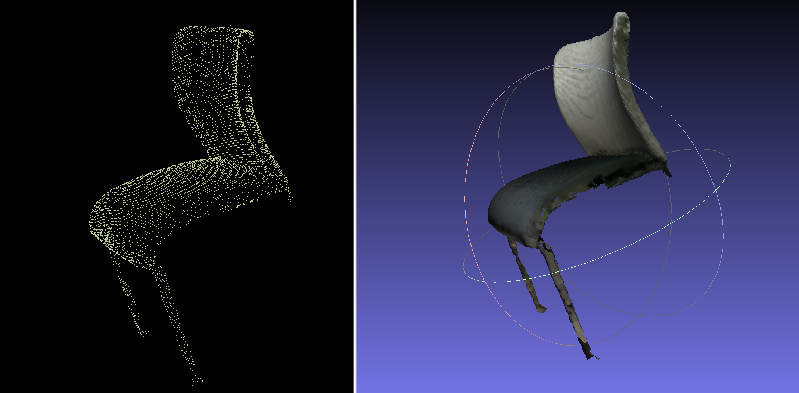
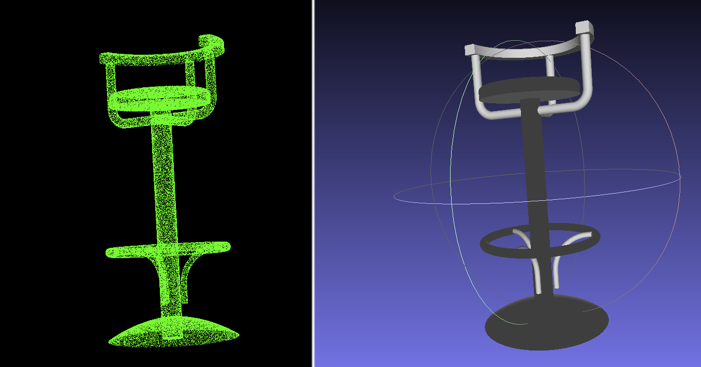
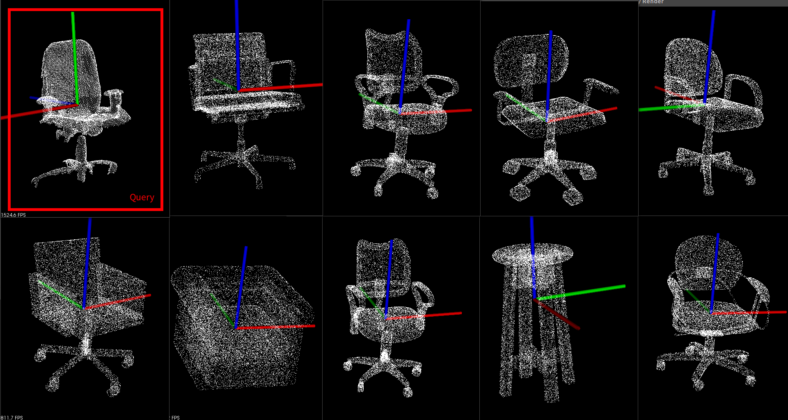

# Fork and Use to RGB-D 3D Model Retrieval

> 2019/08/01	Jiadai Sun  sunjiadai@foxmail.com

|      Query Point Cloud      |         Dataset Model         | Result to be modified |
| :-------------------------: | :---------------------------: | :-------------------: |
|  |  |  |

> If the information of prediction category is used, the result is good(As shown in the figure above), but if it is searched directly in the database, the effect is not perfect and needs to be improved.

### <font color=red>What I have done</font>

- [x] **Making ObjectNN HDF5 Data Set**

  The part of how to deal with SHREC17-ObjectNN, can find in https://github.com/MaxChanger/DealWithSHREC

- [x] **Add** `query_objectnn_clf.py`

  Extract and Used the Global Feature `[1024]` as the Feature of Query & dataset

  Save the result to `GlobalFeature/database0.csv ... database103.csv & query0.csv ... query13.csvq`

- [x] **Add** `calcSimilarity.py`

  Load `database.csv & query.csv` , use **cosine_similarity** to calculate similarity between query and dataset. To be optimized.

- [x] **Add**  `copyAndViewResult.py`

  According to similarity, we can find the highest similarity model in database, copy them to this folder

  ```sh
  ---Result
     |--query201_Chair_OfficeChair
     	  |--036_529b.ply
     	  |--model
     	  	 |--01_Chair_OfficeChair.obj
     	  	 |--...
     	  	 |--10_Chair_OfficeChair.obj  (Top-K)
  ```

- [x] Training model in ModelNet40 and ObjectNN

  Reimplemented ModelNet40  --  the accuracy of classification **89.18%**

  I use **objecnn20_data_hdf5_2048** made by myself ( SHREC'17 Objec) --  the accuracy of classification **64.16%**, if use the pretrained model in ModelNet40, can improve to **66.36%**

  And I use to Global Feature generate by `pointnet-0.663555-0082.pth` to retrieve model

- [x] **Training Semantic Segmentation in indoor3d_sem_seg_hdf5_data**  

  This part of the work was done by the original author. I just reimplemented it again.

- [x] Some `*.sh`  to help me

### <font color=red>Still to be improved</font>

- [ ] If you query directly in the database, the result is not perfect. But if I use category information as a priori information, I can get good results (the first picture)
- [ ] Query speed needs to be improved
- [ ] The way you view results can be optimized


> The following parts are original README.md

---------------------


# Pytorch Implementation of PointNet and PointNet++ 

This repo is implementation for [PointNet](http://openaccess.thecvf.com/content_cvpr_2017/papers/Qi_PointNet_Deep_Learning_CVPR_2017_paper.pdf) and [PointNet++](http://papers.nips.cc/paper/7095-pointnet-deep-hierarchical-feature-learning-on-point-sets-in-a-metric-space.pdf) in pytorch.

## Data Preparation
* Download **ModelNet** [here](http://modelnet.cs.princeton.edu/ModelNet40.zip) for classification and **ShapeNet** [here](https://shapenet.cs.stanford.edu/media/shapenetcore_partanno_segmentation_benchmark_v0_normal.zip) for part segmentation. Uncompress the downloaded data in this directory. `./data/ModelNet` and `./data/ShapeNet`.
* Run `download_data.sh`  and download prepared **S3DIS** dataset for sematic segmantation and save it in `./data/indoor3d_sem_seg_hdf5_data/`

## Classification
### PointNet
* python train_clf.py --model_name pointnet 
### PointNet++
* python train_clf.py --model_name pointnet2 
### Performance
| Model | Accuracy |
|--|--|
| PointNet (Official) |  89.2|
| PointNet (Pytorch) |  **89.4**|
| PointNet++ (Official) | **91.9** |
| PointNet++ (Pytorch) | 91.8 |

* Training Pointnet with 0.001 learning rate in SGD, 24 batchsize and 141 epochs.
* Training Pointnet++ with 0.001 learning rate in SGD, 12 batchsize and 45 epochs.

## Part Segmentation
### PointNet
* python train_partseg.py --model_name pointnet
### PointNet++
* python train_partseg.py --model_name pointnet2
### Performance
| Model | Inctance avg | Class avg	 |aero |	bag |	cap	 |car	 |chair	 |ear phone	 |guitar |	knife |	lamp	 |laptop |	motor	 |mug |	pistol	 |rocket |	skate board |	 table |
|--|--|--|--|--|--|--|--|--|--|--|--|--|--|--|--|--|--|--|
|PointNet (Official)	|**83.7**|**80.4**	|83.4|	78.7|	82.5|	74.9|	89.6	|73|	91.5|	85.9	|80.8|	95.3|	65.2	|93|	81.2|	57.9|	72.8|	80.6|
|PointNet (Pytorch)|	82.4	|78.4|	81.1	|77.8	|83.7	|74.3	|83.3|	65.7|	90.5	|85.1|	78.1	|94.5	|63.7	|91.7	|80.5|56.2	|73.7	|67.5|
|PointNet++ (Official)|**85.1**	|**81.9**	|82.4|79	|87.7	|77.3|	90.8|	71.8|	91|	85.9|	83.7|	95.3	|71.6|	94.1	|81.3|	58.7|	76.4|	82.6|
|PointNet++ (Pytorch)|	84.1|	81.6	|82.6|	85.7|	89.3	|78.1|86.8|	68.9	|91.6|	88.9|	83.9	|96.8	|70.1	|95.7	|82.8|	59.8	|76.3	|71.1|

* Training both Pointnet and Pointnet++ with 0.001 learning rate in Adam, 16 batchsize, about 130 epochs and 0.5 learning rate decay every 20/30 epochs.
* **Class avg** is the mean IoU averaged across all object categories, and **inctance avg** is the mean IoU across all objects.
* In official version PointNet, author use 2048 point cloud in training and 3000 point cloud with norm in testing. In official version PointNet++, author use 2048 point cloud with its norm (Bx2048x6) in both training and testing.
  


## Semantic Segmentation
### PointNet
* python train_semseg.py --model_name pointnet
### PointNet++
* python train_semseg.py --model_name pointnet2
### Performance (test on Area_5)
|Model  | Mean IOU | ceiling | floor | wall | beam | column | window | door |  chair| tabel| bookcase| sofa | board | clutter |
|--|--|--|--|--|--|--|--|--|--|--|--|--|--|--|
| PointNet (Official) | 41.09|88.8|**97.33**|69.8|0.05|3.92|**46.26**|10.76|**52.61**|**58.93**|**40.28**|5.85|26.38|33.22|
| PointNet (Pytorch) | **44.43**|**91.1**|96.8|**72.1**|**5.82**|**14.7**|36.03|**37.1**|49.36|50.17|35.99|**14.26**|**33.9**|**40.23**|
| PointNet++ (Official) |N/A | | | | | | | |
| PointNet++ (Pytorch) | **52.28**|91.7|95.9|74.6|0.1|18.9|43.3|31.1|73.1|65.8|51.1|27.5|43.8|53.8|
* Training Pointnet with 0.001 learning rate in Adam, 24 batchsize and 84 epochs.
* Training Pointnet++ with 0.001 learning rate in Adam, 12 batchsize and 67 epochs.
## Visualization
### Using show3d_balls.py
`cd visualizer`<br>
`bash build.sh #build C++ code for visualization`

### Using pc_utils.py


## TODO

- [x] PointNet and PointNet++ 
- [x] Experiment 
- [x] Visualization Tool

## Reference By
[halimacc/pointnet3](https://github.com/halimacc/pointnet3)<br>
[fxia22/pointnet.pytorch](https://github.com/fxia22/pointnet.pytorch)

## Links
[Official PointNet](https://github.com/charlesq34/pointnet) and [Official PointNet++](https://github.com/charlesq34/pointnet2)
